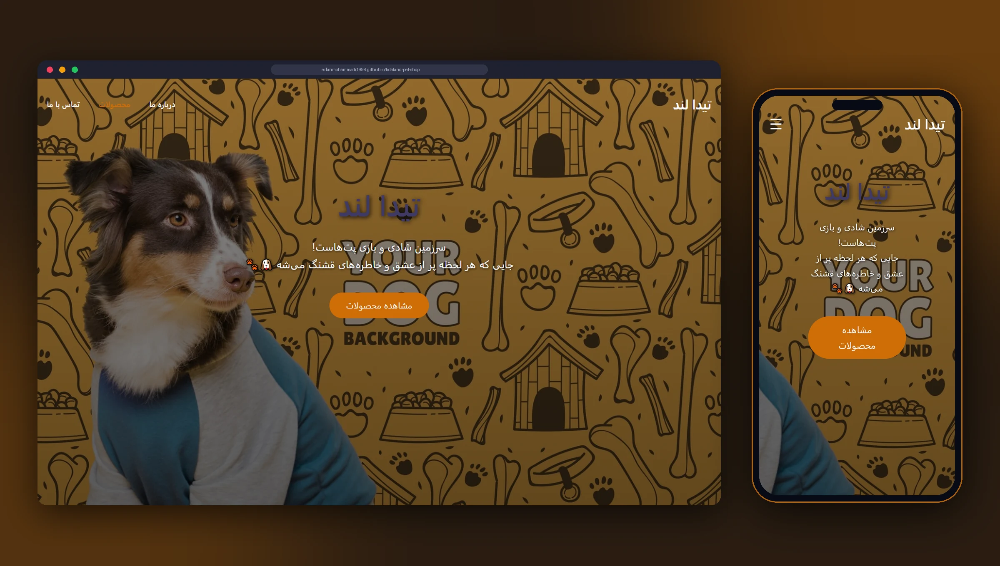
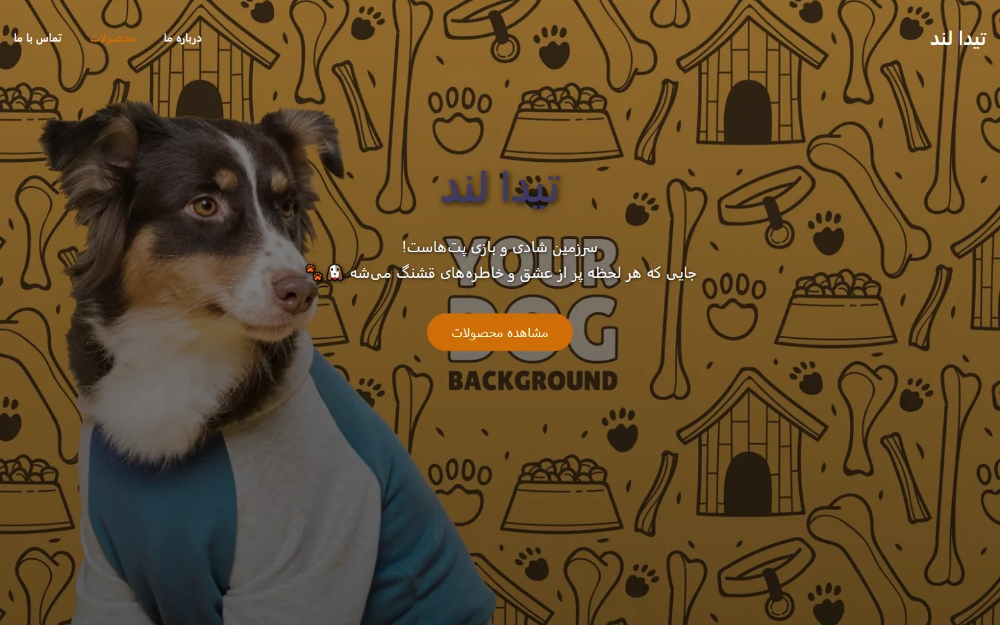
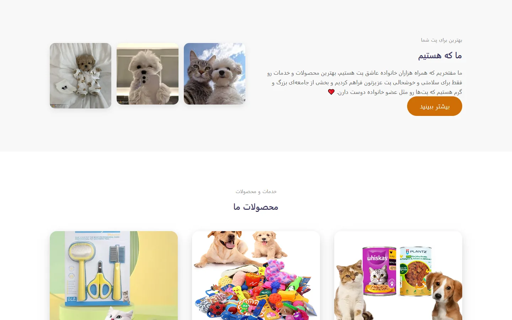
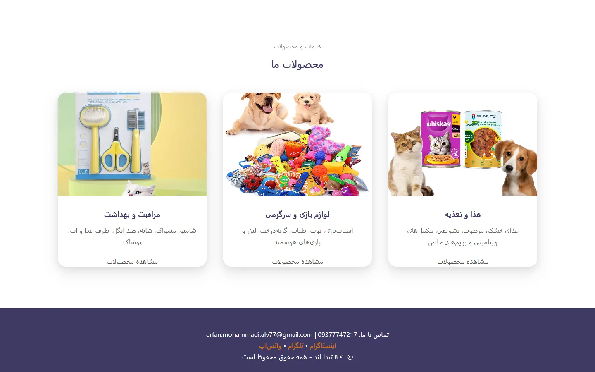
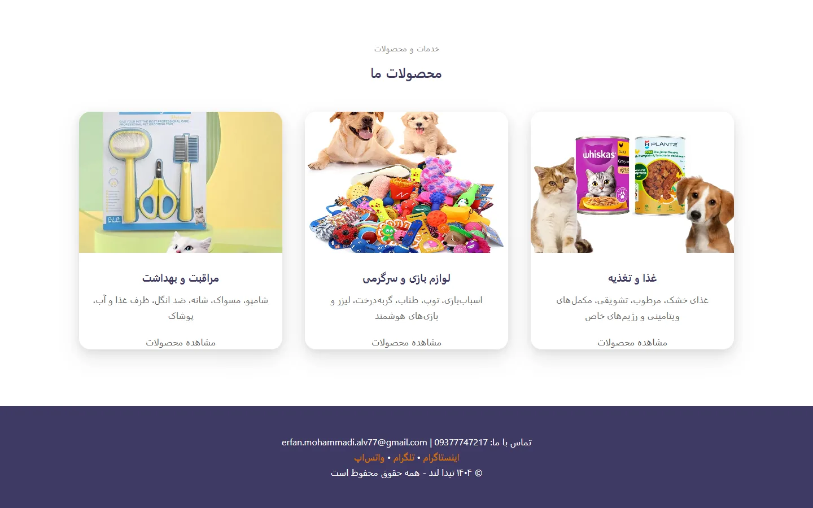
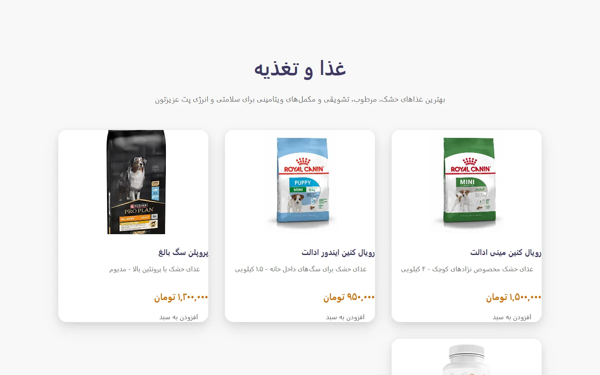
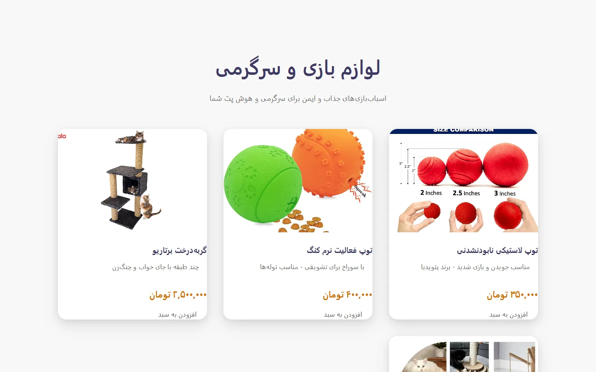
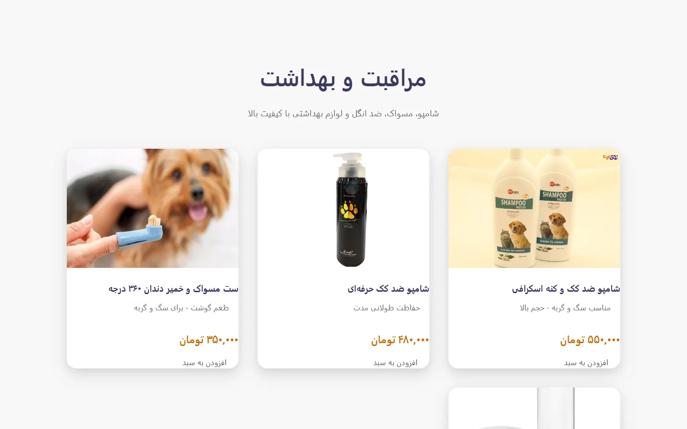
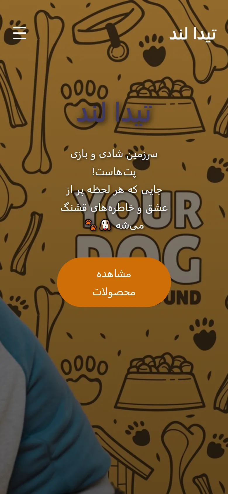
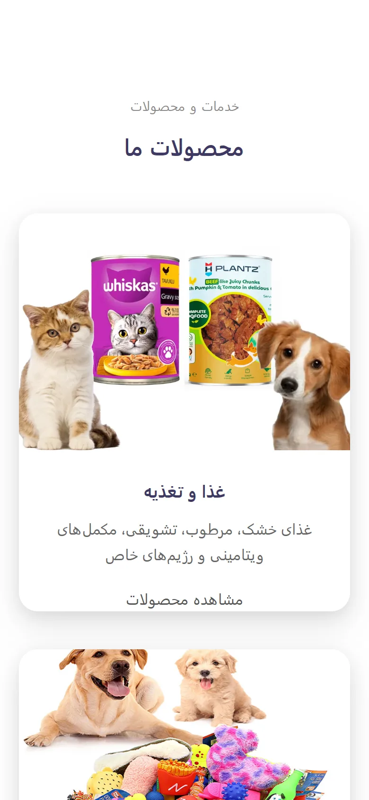

<div align="center">

# 🐾 TidaLand Pet Shop

**A responsive, multi-page pet shop website built with pure HTML5 and CSS3. No frameworks, no build step.**

[](https://erfanmohammadi1998.github.io/tidaland-pet-shop/)


<br>



</div>

---

## 📌 Overview

TidaLand is a storefront website for a pet shop. The shop needed a **lightweight web presence** to showcase its product categories (food, toys and care products) that could be deployed on **simple static hosting** without any build tools or framework dependencies.

The result is a hand-written HTML/CSS site with a fully responsive layout that loads fast and works equally well on phones and desktops.

## ✨ Features

- 🏠 **Landing page** with a full-screen hero, "about us" section and product categories
- 🦴 **Category pages** for food & nutrition, toys & play, and care & hygiene
- 🏷️ **Product cards** with images, descriptions and prices
- 📱 **Responsive layout** designed from scratch, with a mobile hamburger menu
- 🌐 **RTL Persian interface** using the Vazirmatn font
- ⚡ **Zero dependencies**: no frameworks, libraries or build step
- 🚀 **Static hosting**: published on GitHub Pages

## 📸 Screenshots

### Desktop

<table>
  <tr>
    <td width="50%"><b>Home: hero</b><br></td>
    <td width="50%"><b>About us</b><br></td>
  </tr>
  <tr>
    <td><b>Product categories</b><br></td>
    <td><b>Footer & contact</b><br></td>
  </tr>
</table>

### Category pages

<table>
  <tr>
    <td width="33%"><b>Food & nutrition</b><br></td>
    <td width="33%"><b>Toys & play</b><br></td>
    <td width="33%"><b>Care & hygiene</b><br></td>
  </tr>
</table>

### Mobile

<p align="center">
  
  &nbsp;&nbsp;
  
</p>

## 🛠️ Tech stack

| | |
|---|---|
| **Markup** | Semantic HTML5 |
| **Styling** | Hand-written CSS3 (Flexbox, Grid, media queries) |
| **Font** | Vazirmatn (Google Fonts) |
| **Hosting** | GitHub Pages |

## 🚀 Getting started

No installation needed:

```bash
git clone https://github.com/erfanmohammadi1998/tidaland-pet-shop.git
cd tidaland-pet-shop
```

Then open `index.html` in your browser, or serve the folder with any static server:

```bash
python -m http.server 8000
```

## 📁 Project structure

```text
tidaland-pet-shop/
├── index.html        Landing page (hero, about, categories, contact)
├── food.html         Food & nutrition
├── toys.html         Toys & play
├── care.html         Care & hygiene
├── css/style.css     All styles, including responsive breakpoints
├── images/           Product and banner images
└── docs/screenshots/ README screenshots
```

## 🗺️ Roadmap

- [ ] Product search and filtering
- [ ] Shopping cart
- [ ] Product detail pages
- [ ] Dark mode

## 📄 License

Released under the [MIT License](LICENSE).

## 👨‍💻 Author

**Erfan Mohammadi**

[](https://erfanmohammadi.ir/)
[](https://www.linkedin.com/in/erfan-mohammadi77/)
[](https://github.com/erfanmohammadi1998)

---

<div dir="rtl">

## 🇮🇷 خلاصه فارسی

**وب‌سایت فروشگاه حیوانات خانگی تیدالند**: یک وب‌سایت چندصفحه‌ای فروشگاهی که فقط با HTML و CSS ساخته شده؛ واکنش‌گرا، تمیز و بسیار سریع، بدون هیچ فریم‌ورک.

**مسئله:** فروشگاه به یک حضور وب سبک نیاز داشت تا دسته‌بندی محصولات (غذا، اسباب‌بازی و بهداشت) را نمایش دهد و روی هاست ساده و بدون ابزار build قابل انتشار باشد.

**راه‌حل:** سایت چندصفحه‌ای با HTML و CSS خالص، طراحی واکنش‌گرا برای موبایل و دسکتاپ از صفر، و انتشار روی GitHub Pages.

**نتیجه:** سایتی سبک و بسیار سریع که روی موبایل و دسکتاپ به یک اندازه روان اجرا می‌شود.

**[مشاهده نسخه زنده](https://erfanmohammadi1998.github.io/tidaland-pet-shop/)**

</div>
